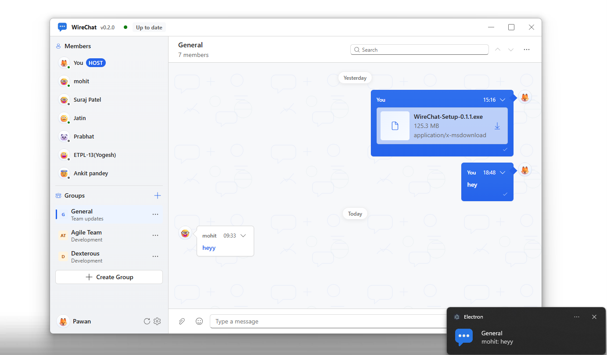
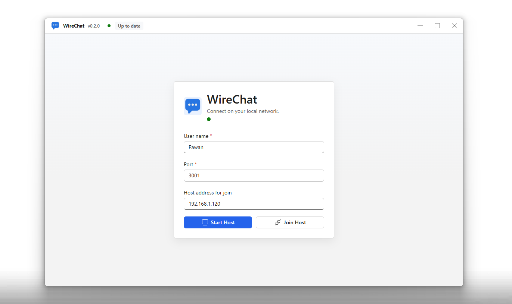

# WireChat



**WireChat is a LAN-first desktop collaboration suite for teams that need fast local communication without a cloud server.**

It started as a chat app, but it has grown into a private local-network workspace with group chat, direct messages, file sharing, screen sharing, remote control, native notifications, presence, read receipts, and LAN-hosted updates.

No hosted backend. No account system. One machine hosts, everyone else joins over the same network.


## Why It Exists

Most team tools assume the internet is always available, accounts are already created, and data can leave the building. WireChat is built for the opposite scenario:

- A classroom or lab where machines are on the same Wi-Fi.
- An office floor that needs quick internal communication.
- A support desk that needs to see and control another user's screen.
- A workshop, training room, cyber cafe, or small company LAN.
- Any place where a lightweight local collaboration tool is better than a cloud dependency.

## Screenshots

### Start Or Join A LAN Workspace



### Chat, Share Files, And Stay Notified


## Features

- **LAN hosting and joining** - start a workspace on one machine and let others join using IP address and port.
- **Group chat** - create team rooms for departments, projects, classes, or support queues.
- **Direct messages** - talk privately with any connected member.
- **File sharing** - upload, preview, download, and share attachments over the local host.
- **Image previews** - inspect shared images without leaving the conversation.
- **Message replies** - keep context attached to the message you are answering.
- **Read and delivered states** - know whether messages reached and were read by recipients.
- **Typing indicators** - see when someone is actively replying.
- **Presence and avatars** - identify users quickly with online status and emoji avatars.
- **Screen sharing** - request or share a desktop view with another user.
- **Remote control** - request permission to control a shared Windows desktop.
- **Native Windows notifications** - receive system notifications for new messages.
- **Tray behavior** - keep WireChat running quietly in the background.
- **Session persistence** - keep users, groups, messages, and attachments across restarts.
- **Saved login flow** - reconnect faster on the same device.
- **LAN auto updates** - packaged clients can pull updates from the connected LAN host.

## Use Cases

- **IT support on a local network** - message a user, request screen sharing, and help from your desk.
- **Classrooms and computer labs** - let students join one local session without accounts or public links.
- **Small office coordination** - keep internal chat and file exchange inside the building network.
- **Training rooms and workshops** - share files, announcements, and live help across machines.
- **Offline or restricted networks** - collaborate when internet access is blocked, unstable, or not desired.
- **Local release distribution** - host update files from one machine and let packaged clients update over LAN.

## Tech Stack

- Electron
- React 19
- Vite
- Fluent UI
- Socket.IO
- Node.js HTTP service
- electron-builder
- electron-updater

## Requirements

- Node.js 18 or newer
- npm
- Windows for the packaged desktop build and remote-control helper
- All users must be on the same LAN or reachable private network

## Quick Start

Install dependencies:

```bash
npm install
```

Run the Electron app in development:

```bash
npm run electron:dev
```

Build the web app:

```bash
npm run build
```

Create a Windows installer:

```bash
npm run dist:win
```

## How To Use

### Start A Host

1. Open WireChat on the machine that will host the workspace.
2. Enter your display name.
3. Choose a port, for example `3001`.
4. Click **Start Host**.
5. Share the host IP address and port with other users on the same LAN.

### Join A Host

1. Open WireChat on another machine connected to the same network.
2. Enter your display name.
3. Enter the host address, for example `192.168.1.120`.
4. Enter the same port used by the host.
5. Click **Join Host**.

### Share Files

1. Open a group or direct message.
2. Click the attachment button near the message composer.
3. Select one or more files.
4. Send the message.
5. Other users can preview supported images or download the file.

### Share Screen Or Request Control

1. Open a direct conversation with a connected member.
2. Start or request screen sharing from the conversation toolbar.
3. The other user accepts the request.
4. For remote control, request control after the screen share is active.
5. The controlled user can stop control at any time.

## LAN Auto Updates

WireChat can serve packaged Windows updates from the LAN host. Connected packaged clients check:

```text
http://<host-ip>:<port>/updates/
```

On the host machine, place generated release files in:

```text
%APPDATA%\WireChat\wirechat-updates
```

For each release, copy:

```text
latest.yml
WireChat-Setup-<version>.exe
WireChat-Setup-<version>.exe.blockmap
```

Then bump `version` in `package.json`, build the new installer, and replace the files in the host update folder. Connected packaged apps show update status in the title bar and can install after download.

## Project Structure

```text
src/                 React UI
src/components/      Chat layout, dialogs, sidebars, messages, avatars
electron/            Electron main process, preload bridge, LAN service, helpers
public/              Icons, screenshots, and static assets
dist/                Production web build output
```

## Security Notes

- WireChat is designed for trusted LAN environments, not public internet exposure.
- Remote control is permission-based and intended for Windows desktop support scenarios.
- Attachments are stored and served by the local host machine.
- There is no cloud sync, hosted database, or external account provider.

## Roadmap Ideas

- Installer download page for LAN users.
- Admin controls for room permissions.
- Better release notes inside the updater.
- Optional encrypted local message storage.
- Portable build for quick lab deployment.

## License

No license has been defined yet.
